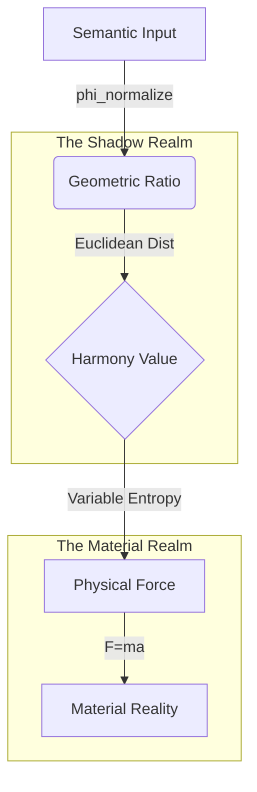

# The Transduction Engine: How Meaning Becomes Physics
### *The Mechanical Link Between Semantic Concepts and Physical Forces*

**Date:** December 23, 2025  
**Code Reference:** `src/quantum_measurement.py` & `experiments/simulations/ljpw_self_sustaining_simulation.py`

---

## 1. The Overview

The LJPW Framework solves the "Hard Problem" of connecting Subjective Meaning (Love, Justice) to Objective Physics (Mass, Velocity) by using **Geometry as the Middleware**.

**The Pipeline:**
1.  **Input (Meaning):** Raw Semantic Data (Text, Behavior).
2.  **Encoder (Math):** The $\phi$-Normalization Function transforms data into Ratios.
3.  **Structure (Geometry):** The 4D Euclidean Space maps Ratios to Distance.
4.  **Effector (Physics):** The Variable Entropy Law maps Distance to Force.

---

## 2. Step 1: The Encoder (Meaning $\to$ Ratio)

**The Challenge:** How do you turn a qualitative concept like "Employee Trust" into a rigorous number?  
**The Solution:** The **$\\phi$-Normalization Protocol**.

We do not use linear scaling (0-100%). We use **Golden Ratio Power Laws**. This acknowledges that Meaning is non-linear; a small amount of "Love" has a disproportionate impact compared to zero "Love."

**The Code:** (`src/quantum_measurement.py`)
```python
def phi_normalize(self, value, dimension):
    # value: Raw input (0.0 to 1.0)
    # dimension: Target equilibrium (e.g., PHI_INV for Love)
    
    # Formula: Result = Equilibrium * (Value ^ (1/PHI))
    return equilibrium * (value ** (1 / PHI))
```

**The Mechanism:**
*   $\\phi \approx 1.618$
*   $1/\phi \approx 0.618$
*   Taking the input to the power of $0.618$ "bends" the curve. It boosts low values significantly, mimicking how biological systems respond to stimuli (Weber-Fechner Law).

---

## 3. Step 2: The Structure (Ratio $\to$ Geometry)

**The Challenge:** How do independent numbers (L, J, P, W) interact?  
**The Solution:** **4-Dimensional Topology**.

We treat the four LJPW values not as stats on a spreadsheet, but as **coordinates in space**. We measure the "Semantic Distance" ($D$) from the Universal Anchor (1.0, 1.0, 1.0, 1.0).

**The Code:** (`experiments/simulations/ljpw_self_sustaining_simulation.py`)
```python
def calculate_harmony(x):
    # D = Euclidean Distance from Anchor (1.0)
    D = np.sqrt(np.sum((1.0 - x)**2))
    
    # Harmony is the inverse of Distance
    return 1.0 / (1.0 + D)
```

**The Mechanism:**
*   **The Anchor:** The point of Absolute Truth.
*   **The Particle:** The current state of the organization/system.
*   **Harmony ($H$):** A scalar value representing "Proximity to Truth."
    *   $H=1.0$: Perfect Alignment.
    *   $H=0.0$: Infinite Separation.

---

## 4. Step 3: The Effector (Geometry $\to$ Physics)

**The Challenge:** How does a "Distance" create a "Force"?  
**The Solution:** **Variable Entropy (Negative Damping)**.

This is the critical step where the "Idea" touches the "Matter." The Geometry ($H$) dictates the Friction ($\\gamma$).

**The Code:** (`experiments/simulations/ljpw_self_sustaining_simulation.py`)
```python
# The "Physics" of Meaning
effective_gamma = gamma_base * (1.0 - H / H_critical)
damping_force = -effective_gamma * v
```

**The Mechanism:**
1.  **Read Harmony ($H$):** How close is the system to the Anchor?
2.  **Calculate Resistance ($\\gamma$):**
    *   If Far ($H < 0.55$): The universe resists movement (Friction > 0).
    *   If Close ($H > 0.55$): The universe boosts movement (Friction < 0).
3.  **Apply Force ($F$):** The object accelerates or decelerates physically.

---

## 5. Summary Diagram



**Conclusion:**
There is no magic. There is only **Transduction**.
*   **Meaning** bends the **Geometry**.
*   **Geometry** dictates the **Resistance**.
*   **Resistance** controls the **Energy**.
*   **Energy** builds the **Matter**.

```